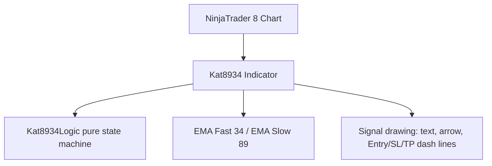

# Project Diary & Graphify Knowledge Base

## 📊 Graphify System Architecture

### Key Entities & Dependencies
- **Component**: `Kat8934` (NinjaTrader Indicator)
- **Domain Logic**: `Kat8934Logic` (pure state machine — touch EMA89 → U-turn close through EMA34 → trigger)
- **Execution Target**: NT8 chart (bip 0 only), `Calculate.OnBarClose`
- **Settings sections**: `1. Chuẩn bị` (reserved), `2. Sell Signal`, `3. Buy Signal`

---

## 📜 Version History & Change Log
### [v0.01] — 2026-08-01
- Initial release: EMA 34/89 rejection signal indicator.
  - Sell: EMA34 < EMA89, price touches/crosses EMA89, U-turns and closes below EMA34; trigger modes `Retest Bounce` (later bar closes back above EMA34) or `Breakdown` (immediate on U-turn close).
  - Buy: mirrored.
  - Drawing: SELL/BUY text + arrow above signal candle; dashed Entry (gold), SL (red), TP (green) lines, all distances in ticks (entry offset 1, SL 60, TP 120 defaults).
  - Version label top-left via `Draw.TextFixed` (updates on F5 recompile).
  - **Validation**: 9/9 xunit tests; CompileCheck 0 errors.
- **Graphify entity mapping**: `Kat8934Logic.Update`, `Kat8934.OnBarUpdate`, `Kat8934.DrawSignal`, `Kat8934TriggerMode`, `Kat8934LogicTests`.
