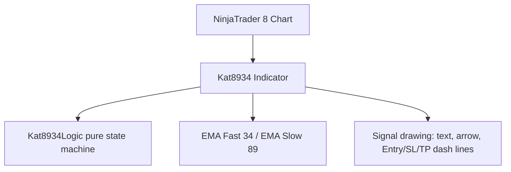

# Project Diary & Graphify Knowledge Base

## 📊 Graphify System Architecture

### Key Entities & Dependencies
- **Component**: `Kat8934` (NinjaTrader Indicator)
- **Domain Logic**: `Kat8934Logic` (pure state machine — touch EMA89 → U-turn close through EMA34 → trigger)
- **Execution Target**: NT8 chart (bip 0 only), `Calculate.OnBarClose`
- **Settings sections**: `1. Chuẩn bị` (reserved), `2. Sell Signal`, `3. Buy Signal`

---

## 📜 Version History & Change Log
### [v0.19] — 2026-08-02
- **Codebase split into 4 modules (partial classes, KatTradeManager pattern)**: the monolithic `Kat8934.cs` (~1450 lines) is now `Kat8934.cs` (main: lifecycle, settings, per-bar orchestration) + `src/Kat8934.Signal.cs` + `src/Kat8934.Filter.cs` + `src/Kat8934.Bot.cs` + `src/Kat8934.Draw.cs`; `src/Kat8934Logic.cs` stays the pure xunit-tested core. Zero logic changes — pure code motion, every method moved verbatim.
- **Signal module sub-modules**: A0 (EMA-ribbon fan) and A1 (89-34 pullback) are explicit regions (`EvaluateA0Fan` / `EvaluateA1`); future signals plug in as a new region. Filter module isolates `PassFilters`/`MtfPass`/`MarketPass`/`TimePass` (MACD/RSI plug in later). Bot module owns order conversion (stop/limit), ATM levels, migration. Draw module owns all chart drawings + HUD.
- **HUD module titles + reshuffled sections**: every section now has a small caps title naming its module — **SIGNAL** (`A0 fan` + new `A1 89-34` HUD toggle wired to `SignalEnabled`, A2…/A3… placeholders moved here), **FILTER** (MTF/ADX/Volume/Time window), **BOT** (account, ATM, BOT on/off), **DRAW** (Arrow/Text, Clear).
- **Build/deploy future-proofing**: `Deploy-NT8.ps1` now copies `src/*.cs` by wildcard and `CompileCheck.csproj` compiles `src/*.cs` — new module files need zero script changes. Tests project still references only `Kat8934Logic.cs`.
- **Validation**: 33/33 xunit tests; CompileCheck 0 errors (net48 + NT8 assemblies).
- **Graphify entity mapping**: `Kat8934` partials — `Kat8934.Signal.cs` (`EvaluateA0Fan`, `EvaluateA1`, `cachedA0/cachedA1`, `sellState/buyState`), `Kat8934.Filter.cs` (`PassFilters`, `SeriesFanDirection`, `MtfPass`, `MarketPass`, `TimePass`), `Kat8934.Bot.cs` (`SubmitBotOrder`, `ManageBotEntry`, `GetAtmData`), `Kat8934.Draw.cs` (`DrawSignal`, `BuildHud`, `CreateModuleTitle`, `ApplyDrawMode`), `Kat8934.OnBarUpdate` (module pipeline).

### [v0.18] — 2026-08-02
- **Bot entry stop/limit auto-conversion**: user strategy spec confirmed — pending stop entry, converted to limit when price already ran past it. `SubmitBotOrder` previously always used `OrderType.StopMarket`; a sell stop above market (fast drop through the entry before submit) would be rejected. New pure helper `Kat8934Logic.UseStopOrder(isBuy, trigger, current)` (same rule as `KatTradeManager.DetermineOrderType`): stop only on the valid side, else `OrderType.Limit` at the same price. New `pendingEntryPrice` field for correct Filled/cancel prints (limit orders report `StopPrice = 0`). Signal sequence itself re-verified against the user's annotated chart: arm beyond ema34 → close-basis cross → ema89 touch → U-turn close through ema34 → entry below/above the U-turn bar.
- **Validation**: 33/33 xunit tests (+2 stop/limit rule tests); CompileCheck 0 errors.
- **Graphify entity mapping**: `Kat8934Logic.UseStopOrder`, `Kat8934.SubmitBotOrder` (stop/limit branch), `Kat8934.pendingEntryPrice`.

### [v0.17] — 2026-08-02
- **A1 sequence rebuilt to spec + bounded lookback**: the old machine latched `touched89` forever and never required price to come from beyond ema34 (a fall from above ema89 straight through ema34 could fire). New explicit phases (`KatA1State.Phase` 0→3): price must first close BEYOND ema34 (sell: below / buy: above = armed), then cross back through ema34 on close basis (pullback start, wicks do not count), touch/cross ema89, then U-turn close through ema34. New setting `Max Sequence Bars` (default 30): the whole sequence — cross, touch, U-turn and the retest trigger — must complete within N bars or it expires and rearms. Failed pullbacks (close back through ema34 before any ema89 touch) rearm without stale state.
- **ATM trailing-SL trigger lines (KatTradeManager style)**: new `Kat8934AtmParser` reads StopLoss/Target/AutoBreakEven/AutoTrail profit triggers from the selected ATM template (parsed once per template name, cached). On a signal: SL/TP lines use the ATM template values when defined (settings `Stop/Target Distance` are fallbacks), and BE (DeepSkyBlue dash-dot), SL1 (orange dot), SL2 (magenta dot) trigger lines draw at entry ± trigger ticks — same colors/styles/widths as KatTradeManager. Template `None`/missing → settings SL/TP only, no trigger lines. Types named `Kat8934*` to avoid colliding with KatTradeManager inside NT8's single NinjaScript assembly.
- **Timeframe proof**: version label now shows the chart timeframe (`Kat8934 v0.17 (2026-08-02) [30 Second]`) and the load Print names the instrument + series. All signal math already runs on `BarsArray[0]` (the chart the indicator is added to); the `BaseBarsPeriodType Minute / 1` seen in workspace XML is NT8 base-data metadata — the operative fields are `BarsPeriodTypeSerialize=3` (Second) + `Value=30`.
- **Arrows confirmed**: buy = white up-arrow, sell = black down-arrow (unchanged from v0.16).
- **Validation**: 31/31 xunit tests (sequence rewritten: arm-from-beyond-ema34 required, wick≠cross, expiry at N bars incl. boundary, failed-pullback rearm, trend-loss reset, both modes both sides, C1/C2 tracking; +3 ATM parser tests); CompileCheck 0 errors.
- **Graphify entity mapping**: `Kat8934Logic.Update` (KatA1State phase machine, maxSeqBars), `KatA1State`, `Kat8934AtmParser`, `Kat8934AtmData`, `Kat8934.MaxSequenceBars`, `Kat8934.GetAtmData`, `Kat8934.DrawSignal` (ATM levels, BE/SL1/SL2 lines), `Kat8934.ChartTimeframe`, `Kat8934.DrawVersionLabel` (TF stamp).

### [v0.16] — 2026-08-01
- **Full-codebase reaudit fixes**:
  - `Clear` now also removes A0 fan markers (tag prefix `K8934_A0_` was missing from the doomed-prefix list — triangles survived every clear).
  - `pendingMigrate` made `volatile` — written from the UI thread (BOT OFF) and read on the data thread; plain bool had no visibility guarantee.
  - `BotOrderQuantity` setter clamps to ≥1 — `CreateOrder` would fail at runtime on 0/negative from the property grid.
  - Stale `fanEmas` comment updated (conditional MTF series: indexes live in `bip3m/bip5m/bip15m`, -1 = not added).
- **Audited, intentionally left as-is**: ATM submit failure dangling Initialized order (harmless — no chart pins, guarded by File.Exists); >200-signal FIFO drops toggle control of the oldest drawings (pre-existing, cosmetic); missing-template warning prints per signal (noise, but a real warning).
- **Validation**: 30/30 xunit tests; CompileCheck 0 errors.
- **Graphify entity mapping**: `Kat8934.ClearOldSignalDrawings` (A0 prefix), `Kat8934.pendingMigrate` (volatile), `Kat8934.BotOrderQuantity` (clamped setter).

### [v0.15] — 2026-08-01
- **HUD redesigned to match KatTradeManager exactly** (colors, sizes, structure — cloned from `KatTradeManagerUI.cs`): full-stretch `Canvas` host (ZIndex 9999) + 240px draggable panel (`PreviewMouse*` handlers with `handledEventsToo`, `IsInteractiveVisual` guard so buttons/combos don't start a drag, ≥40px clamp keeps it on-chart, position survives rebuilds); `⚡ KAT 8934 vX.XX` steel-blue header `Rgb(70,130,160)`; 32px status `TextBlock` with 5s auto-clear `DispatcherTimer`; section cards `Rgb(10,12,18)` + `Rgb(35,42,56)` border, radius 5; `AddGridRow` "Acc:" param row (85px label col); two-column star/4px/star button grids; toggle style unified (ON blue `Rgb(0,122,204)` white text / OFF gray `Rgb(45,50,65)` LightGray text); dark `Rgb(20,20,20)` Clear.
- **Sections**: 1. Account & ATM (Acc row + sorted ATM dropdown), 2. Filters (A0 fan|MTF, ADX|Volume, Time window), 3. Bot & Display (`⚡ BOT: ON/OFF`, Arrow|Text, disabled A2…|A3…, Clear).
- **Bot feedback on HUD**: `ShowHudStatus` on submit (LightGreen), fill, submit error / cancel (OrangeRed), BOT ON/OFF click — marshaled to the UI dispatcher from the data thread.
- **Validation**: 30/30 xunit tests; CompileCheck 0 errors.
- **Graphify entity mapping**: `Kat8934.BuildHud` (canvas + sections), `CreateSectionCard`/`CreateTwoColGrid`/`AddGridRow`/`CreateFilterToggle`, `ShowHudStatus`/`hudStatusTimer`, drag handlers (`OnHudPreviewMouse*`/`StopHudDrag`/`IsInteractiveVisual`/`GetHudParent`), `RemoveHud` (timer + canvas cleanup).

### [v0.14] — 2026-08-01
- **Fix — chart EMA distortion**: `State.Configure` unconditionally added 3m/5m/15m series, forcing NT8 to reload/realign chart data (other chart indicators, e.g. an EMA 89, reseeded and looked completely different). Series are now added **only for enabled MTF timeframes**; BarsArray indexes mapped via `bip3m/bip5m/bip15m` (-1 = not added), `MtfPass` uses the map. With all MTF filters off (default) the chart keeps its single 30s series — zero interference with existing chart EMAs.
- **Fix — orphan order safety**: `State.Terminated` now cancels the pending bot entry (`CancelPendingBotOrder("indicator terminated")`) and clears `pendingMigrate` — removing/F5-ing the indicator no longer orphans a live stop order.
- **Cosmetic**: version Print in `DataLoaded` dedented out of the time-parse else branch (executed unconditionally already; misleading indentation).
- **Validation**: 30/30 xunit tests; CompileCheck 0 errors. No logic changes — test count unchanged.
- **Graphify entity mapping**: `Kat8934.bip3m/bip5m/bip15m`, `Kat8934.MtfPass` (mapped bips), `State.Configure` (conditional AddDataSeries), `State.Terminated` (bot cancel).

### [v0.13] — 2026-08-01
- **Semi-auto bot**: trades only while HUD `BOT: ON` *and* `Bot Enabled` — never on its own. BOT OFF cancels the pending entry (Dispatcher.InvokeAsync → data thread). On an A1 signal: `Account.CreateOrder` StopMarket (`OrderEntry.Manual`, GTC, name **"Entry"** — the ATM contract from KatTradeManager), then `AtmStrategy.StartAtmStrategy(tpl, order)` when the template file exists, else `account.Submit` bare stop (missing template warns, never orphans).
- **Migration**: `ManageBotEntry` polls the pending order each bar on the data thread (no OrderUpdate subscription). Better extreme (sell: higher low / buy: lower high, still closing on the setup side of ema34) → cancel + re-place at the better price once the cancelled order is terminal (`pendingMigrateRef` replay). 34/89 trend flip cancels. Filled → ATM owns brackets. One bot order at a time.
- **Settings**: new `4. Bot` group (Bot Enabled, Order Quantity, ATM Template via `Kat8934AtmTemplateConverter` listing `templates\AtmStrategy\*.xml` + None, Account Name).
- **HUD row 3**: BOT toggle (default OFF), sorted ATM ComboBox, Account ComboBox (`Account.All`), disabled `A2…`/`A3…` placeholders.
- **Validation**: 30/30 xunit tests; CompileCheck 0 errors. Order path is NT8-runtime only — verify on Sim101 before any live account.
- **Graphify entity mapping**: `Kat8934.TrySubmitBotEntry`/`SubmitBotOrder`/`ManageBotEntry`/`CancelPendingBotOrder`/`ResolveBotAccount`/`HasAtmTemplate`, `Kat8934.pendingOrder`/`pendingMigrateRef`, `Kat8934AtmTemplateConverter`, `4. Bot` properties, HUD row3 (`btnBot`, atmCombo, accCombo).

### [v0.12] — 2026-08-01
- **A1 dual entry C1/C2**: new `Kat8934Logic.Update` overload with `ref double c1, ref double c2` (old signature delegates — existing tests untouched). C1 = U-turn bar extreme (sell: low / buy: high); while the setup is alive, a later bar still closing on the setup side of the fast EMA with a better extreme raises C2 (sell: higher low / buy: lower high). Candidates reset on trend loss.
- **`Kat8934Logic.EffectiveEntry`**: sell takes the higher stop (`max(c1,c2) - offset`), buy the lower (`min(c1,c2) + offset`) — the solid entry line now sits at the better candidate; C1/C2 drawn as faded dotted lines (opacity 0.35, `K8934_*_C1_/C2_` tags, cleared by prefix) only when they differ. Fallback to the signal bar when a candidate is 0.
- **Validation**: 30/30 xunit tests (1 test-authoring fix: buy C2 bar needs close above the drifted ema34); CompileCheck 0 errors.
- **Graphify entity mapping**: `Kat8934Logic.Update` (c1/c2 overload), `Kat8934Logic.EffectiveEntry`, `Kat8934.sellC1/sellC2/buyC1/buyC2`, `Kat8934.DrawSignal` (candidate refs, faded C1/C2 lines).

### [v0.11] — 2026-08-01
- **A0 EMA-ribbon fan filter**: pure `Kat8934Logic.FanDirection` — 9/21/34/55/89/144/200 EMAs strictly ordered + total spread (EMA9↔EMA200) wider than `Fan Spread Lookback` bars ago + at least `Fan Min Spread (ticks)`. Fires once per fan episode: small triangle marker (buy DodgerBlue below / sell OrangeRed above) + `PlaySound(AlertSound)`; re-arms when the fan collapses.
- **MTF fan filter**: `AddDataSeries` 3m/5m/15m always (toggles gate evaluation only — keeps BarsArray indexes stable); `MtfPass` requires every enabled TF to fan in the primary direction.
- **Market filter** (`Kat8934Logic.PassMarketFilter`): ADX ≥ `Adx Min` blocks sideways; bar volume ≥ `Volume Min (x SMA)` × SMA(volume) blocks dead bars.
- **Time window** (`Kat8934Logic.IsInTimeWindow`): `HH:mm` strings parsed in DataLoaded (bad input disables the window with a warning Print); overnight windows wrap midnight; start==end disables.
- **A1 gating**: Sell needs a sell fan (Buy mirrored) + MTF + market + time; any filter OFF (settings or HUD) removes its leg. A1 signals also play the alert sound.
- **HUD row 2**: `A0 / MTF / ADX / Vol / Time` toggle buttons (`CreateFilterToggle`) flip volatile cached flags — effective next bar, blue ON / gray OFF.
- **Settings**: new `1. Filters` group (13 settings); `Alert Sound` dropdown via `Kat8934SoundConverter` listing NT8 `sounds\*.wav`.
- **Validation**: 23/23 xunit tests; CompileCheck 0 errors.
- **Graphify entity mapping**: `Kat8934Logic.FanDirection`/`PassMarketFilter`/`IsInTimeWindow`, `Kat8934.EvaluateFilters`/`SeriesFanDirection`/`MtfPass`/`MarketPass`/`TimePass`/`PlayAlertSound`, `Kat8934.CreateFilterToggle`, `Kat8934SoundConverter`, `Kat8934.fanEmas`/`a0Dir`/`a0Alerted`, `1. Filters` properties.

### [v0.10] — 2026-08-01
- **Text column bug**: Text toggle redrew labels at `barsAgo` relative to the current bar → historical labels stacked at the right chart edge. Metadata probe (MetadataLoadContext against NinjaTrader.Custom.dll) proved `Draw.Text` has no simple DateTime overload; redraws now use `barsAgo = CurrentBars[0] - r.Bar` for both labels and arrows.
- **Hide button removed** from the HUD; HUD now: Clear, Arrow: ON/OFF, Text: ON/OFF.
- **Arrow Offset (ticks)** setting (default 3) — arrow distance from the candle.
- **Settings merged**: `2. Sell Signal` + `3. Buy Signal` → single `2. Signal` group (Enabled, EmaFastPeriod, EmaSlowPeriod, TriggerMode, EntryOffsetTicks, StopDistanceTicks, TargetDistanceTicks); `4. Lines & Text` → `3. Lines & Text` (+ArrowOffsetTicks). EMAs reduced to one fast/slow pair.
- **Validation**: 9/9 xunit tests; CompileCheck 0 errors.
- **Graphify entity mapping**: `Kat8934.ApplyDrawMode` (barsAgo redraw), `Kat8934.DrawSignal` (barsAgo 0, arrow offset), `Kat8934.BuildHud` (3 buttons), `Kat8934.SignalEnabled`/`EmaFastPeriod`/`EmaSlowPeriod`/`TriggerMode`/`EntryOffsetTicks`/`StopDistanceTicks`/`TargetDistanceTicks`/`ArrowOffsetTicks`, `KatSignalRecord` (SignalTime removed).

### [v0.09] — 2026-08-01
- **Instant HUD reaction**: replaced the pending-flag consumption (which only ran on the next bar close) with direct `Dispatcher.InvokeAsync(() => ...)` marshaling to the data thread from every HUD click handler — `Clear`, `Arrow`, `Text` toggles now apply immediately. `pendingClearSignals`/`pendingDrawMode` removed; `ClearOldSignalDrawings`/`ApplyDrawMode` got boundary try/catch.
- **2x arrows**: verified NT8 8.1.9 `Draw.Arrow*` has no sizePixels overload (metadata scan of NinjaTrader.Gui.dll) — arrows drawn twice 1 tick apart (`K8934_*_ARROW_<bar>` + `_2`), Buy white / Sell black; `KatSignalRecord.ArrowY2` stores the second anchor for toggle redraws.
- **Validation**: 9/9 xunit tests; CompileCheck 0 errors.
- **Graphify entity mapping**: `Kat8934.BuildHud` (Dispatcher.InvokeAsync wiring), `Kat8934.ApplyDrawMode`, `Kat8934.ClearOldSignalDrawings`, `Kat8934.DrawSignal` (double arrows, colors), `Kat8934.KatSignalRecord.ArrowY2`.

### [v0.08] — 2026-08-01
- **HUD toggle reactivity fix**: Arrow/Text toggles now apply immediately to all already-drawn signals. `DrawSignal` records each signal in `signalRecords` (max 200, FIFO); the HUD buttons set a volatile `pendingDrawMode` bitmask (1 = arrows, 2 = labels) which `OnBarUpdate` consumes on the data thread via `ApplyDrawMode` — OFF removes the matching `K8934_*_ARROW_*`/`K8934_*_TEXT_*` objects, ON redraws them from the records. `Clear` also clears `signalRecords` so toggles cannot resurrect cleared drawings.
- **UI language**: HUD buttons translated to English (`Clear`, `Arrow: ON/OFF`, `Text: ON/OFF`, `Hide/Show`); Vietnamese comments replaced.
- **Validation**: 9/9 xunit tests; CompileCheck 0 errors.
- **Graphify entity mapping**: `Kat8934.ApplyDrawMode`, `Kat8934.signalRecords`, `Kat8934.pendingDrawMode`, `Kat8934.KatSignalRecord`, `Kat8934.BuildHud` (English labels + toggle wiring), `Kat8934.DrawSignal` (record add), `Kat8934.ClearOldSignalDrawings` (records cleared).

### [v0.07] — 2026-08-01
- Entry lines solid per side: `SellEntryLineColor` (bright red) / `BuyEntryLineColor` (bright lime green) replace shared gold `EntryLineColor`; SL/TP remain dashed.
- BUY/SELL labels bright (buy lime green, sell red), Buy below entry line / Sell above, `ShowLabels` default **false**; `ShowArrows` default true. HUD buttons `Mũi tên: ON/OFF` + `Chữ: ON/OFF` toggle `cachedShowArrows`/`cachedShowLabels` (volatile, write through to persisted properties), blue ON / gray OFF.
- `CreateHudButton` helper mirrors KatTradeManager's `CreateButton` (borderless, white, h24, padding 2).
- **Validation**: 9/9 xunit tests; CompileCheck 0 errors.
- **Graphify entity mapping**: `Kat8934.CreateHudButton`, `Kat8934.BuildHud` (arrow/label toggles), `Kat8934.DrawSignal` (solid entry lines, per-side colors, conditional arrow/label), `Kat8934.ShowArrows`, `Kat8934.ShowLabels`, `Kat8934.SellEntryLineColor`, `Kat8934.BuyEntryLineColor`.

### [v0.06] — 2026-08-01
- **HUD layout squeeze fix**: HUD was attached to `ChartControl.Children` — ChartControl is the grid laying out the price panel, so a direct child forced empty gaps on both sides and squeezed the chart to the middle. HUD now attaches to the outer grid (`ChartControl.Parent as Grid`, matching KatTradeManager's `chartGrid` pattern); removal walks `hudBorder.Parent`.
- **Validation**: 9/9 xunit tests; CompileCheck 0 errors.
- **Graphify entity mapping**: `Kat8934.BuildHud` (host = `ChartControl.Parent as Grid`), `Kat8934.RemoveHud` (parent-based removal).

### [v0.05] — 2026-08-01
- HUD restyled to match the KatTradeManager HUD (graphics + position only — no new features or buttons):
  - Panel: background `Argb(240,20,24,33)`, border `Rgb(35,42,56)` 1px, `CornerRadius(6)`, `Padding(8)`; buttons borderless (`BorderThickness 0`, `Padding(2)`, white foreground, height 24, font 12). Xóa Line uses the destructive dark `Rgb(20,20,20)`; Ẩn/Hiện uses OFF-gray `Rgb(45,50,65)`.
  - Position: bottom-left of chart, 10px left inset, 4px bottom (KatTradeManager InChart placement).
- **Validation**: 9/9 xunit tests; CompileCheck 0 errors.
- **Graphify entity mapping**: `Kat8934.BuildHud` (panel/button styling), `Kat8934.hudBorder`.

### [v0.04] — 2026-08-01
- **Anchor bug fixed (long lines)**: `DrawSignal` passed `CurrentBar` (absolute index) as `barsAgo` to `Draw.Line`/`Arrow`/`Text` — NT8 measures barsAgo from the right chart edge, so anchors jumped to the chart start and every signal line spanned the full chart. All anchors now use `0` (the signal bar), lines extend `Line Length (bars)` forward.
- **HUD panel** (top-center overlay, WPF): `Xóa Line` clears all `K8934_S_`/`K8934_B_` draw objects via a volatile flag consumed on the data thread (then redraws the version label); `Ẩn/Hiện` toggles HUD visibility. Built in `DataLoaded` via dispatcher, removed on `Terminated`.
- **Validation**: 9/9 xunit tests; CompileCheck 0 errors.
- **Graphify entity mapping**: `Kat8934.DrawSignal` (barsAgo anchors), `Kat8934.BuildHud`, `Kat8934.RemoveHud`, `Kat8934.ClearOldSignalDrawings`, `Kat8934.DrawVersionLabel`, `Kat8934.pendingClearSignals`.

### [v0.03] — 2026-08-01
- Entry/SL/TP lines shortened to configurable length (default 7 bars forward, `Line Length (bars)`), replacing the previous fixed anchors.
- New settings group `4. Lines & Text`: `Line Length (bars)`, `Line Width (px)`, `Entry Line Color`, `SL Line Color`, `TP Line Color`, `Sell Text Color`, `Buy Text Color` (NT8 `Color` + hidden serializable-string pattern).
- SELL/BUY label moved next to the entry line end (vertical offset 1 tick, same side as arrow direction); arrow color follows the text color.
- **Validation**: 9/9 xunit tests; CompileCheck 0 errors.
- **Graphify entity mapping**: `Kat8934.DrawSignal` (line/text anchors + colors), `Kat8934.ParseColor`, properties `LineLengthBars`, `LineWidth`, `EntryLineColor`, `SLLineColor`, `TPLineColor`, `SellTextColor`, `BuyTextColor` + `*Serializable`.

### [v0.02] — 2026-08-01
- Indicator moved into the **KAT** folder in NT8 Add Indicator dialog: namespace changed from `NinjaTrader.NinjaScript.Indicators` to `NinjaTrader.NinjaScript.Indicators.KAT`.
- No logic changes. 9/9 xunit tests, CompileCheck 0 errors.
- **Graphify entity mapping**: `Kat8934` (namespace `NinjaTrader.NinjaScript.Indicators.KAT`).

### [v0.01] — 2026-08-01
- Initial release: EMA 34/89 rejection signal indicator.
  - Sell: EMA34 < EMA89, price touches/crosses EMA89, U-turns and closes below EMA34; trigger modes `Retest Bounce` (later bar closes back above EMA34) or `Breakdown` (immediate on U-turn close).
  - Buy: mirrored.
  - Drawing: SELL/BUY text + arrow above signal candle; dashed Entry (gold), SL (red), TP (green) lines, all distances in ticks (entry offset 1, SL 60, TP 120 defaults).
  - Version label top-left via `Draw.TextFixed` (updates on F5 recompile).
  - **Validation**: 9/9 xunit tests; CompileCheck 0 errors.
- **Graphify entity mapping**: `Kat8934Logic.Update`, `Kat8934.OnBarUpdate`, `Kat8934.DrawSignal`, `Kat8934TriggerMode`, `Kat8934LogicTests`.
