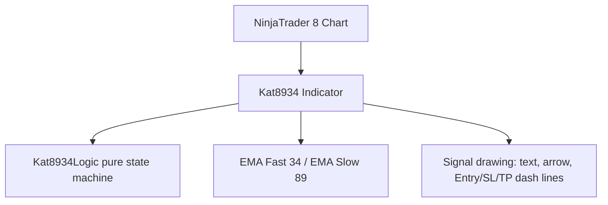

# Project Diary & Graphify Knowledge Base

## 📊 Graphify System Architecture

### Key Entities & Dependencies
- **Component**: `Kat8934` (NinjaTrader Indicator)
- **Domain Logic**: `Kat8934Logic` (pure state machine — touch EMA89 → U-turn close through EMA34 → trigger)
- **Execution Target**: NT8 chart (bip 0 only), `Calculate.OnBarClose`
- **Settings sections**: `1. Chuẩn bị` (reserved), `2. Sell Signal`, `3. Buy Signal`

---

## 📜 Version History & Change Log
### [v0.03] — 2026-08-01
- Entry/SL/TP lines shortened to configurable length (default 7 bars forward, `Line Length (bars)`), replacing the previous fixed anchors.
- New settings group `4. Lines & Text`: `Line Length (bars)`, `Line Width (px)`, `Entry Line Color`, `SL Line Color`, `TP Line Color`, `Sell Text Color`, `Buy Text Color` (NT8 `Color` + hidden serializable-string pattern).
- SELL/BUY label moved next to the entry line end (vertical offset 1 tick, same side as arrow direction); arrow color follows the text color.
- **Validation**: 9/9 xunit tests; CompileCheck 0 errors.
- **Graphify entity mapping**: `Kat8934.DrawSignal` (line/text anchors + colors), `Kat8934.ParseColor`, properties `LineLengthBars`, `LineWidth`, `EntryLineColor`, `SLLineColor`, `TPLineColor`, `SellTextColor`, `BuyTextColor` + `*Serializable`.

### [v0.02] — 2026-08-01
- Indicator moved into the **KAT** folder in NT8 Add Indicator dialog: namespace changed from `NinjaTrader.NinjaScript.Indicators` to `NinjaTrader.NinjaScript.Indicators.KAT`.
- No logic changes. 9/9 xunit tests, CompileCheck 0 errors.
- **Graphify entity mapping**: `Kat8934` (namespace `NinjaTrader.NinjaScript.Indicators.KAT`).

### [v0.01] — 2026-08-01
- Initial release: EMA 34/89 rejection signal indicator.
  - Sell: EMA34 < EMA89, price touches/crosses EMA89, U-turns and closes below EMA34; trigger modes `Retest Bounce` (later bar closes back above EMA34) or `Breakdown` (immediate on U-turn close).
  - Buy: mirrored.
  - Drawing: SELL/BUY text + arrow above signal candle; dashed Entry (gold), SL (red), TP (green) lines, all distances in ticks (entry offset 1, SL 60, TP 120 defaults).
  - Version label top-left via `Draw.TextFixed` (updates on F5 recompile).
  - **Validation**: 9/9 xunit tests; CompileCheck 0 errors.
- **Graphify entity mapping**: `Kat8934Logic.Update`, `Kat8934.OnBarUpdate`, `Kat8934.DrawSignal`, `Kat8934TriggerMode`, `Kat8934LogicTests`.
